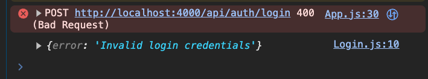
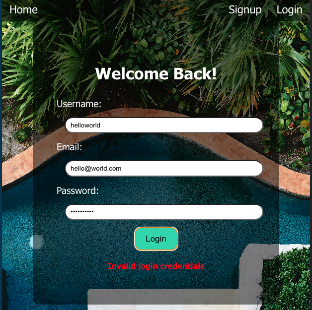
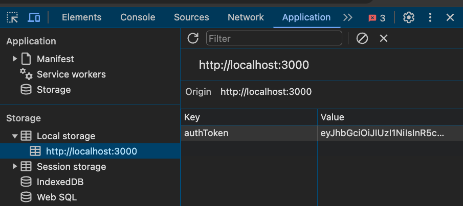

# React Authentication with JWT

## Learning Objectives

Students will learn how to: 
- store tokens in local storage
- conditionally render UI 
- remove tokens from local storage
- display errors returned from the server
- fetch data from protected routes

## Setup

1. Fork / Clone down this repo
2. Run installations `npm i`
3. Briefly examine existing code

## Framing

We've already built out our backend for this app. It handles creating tokens, verifying tokens, and protecting our routes. Our frontend's job is to store the token provided to a user who's logged in and provide the token to any API call that's a protected route via headers.

Any UI we want to conditionally render depending on a logged in status will be done on the front. Visual? Frontend. Verification? Backend. 

You can think of it like visiting a bar. The bouncer (backend auth) checks for a valid ID (logging in) before letting you inside. Once you are inside the bar, you can do a lot of things without requiring your ID being checked again (unprotected routes). However, if you were to order a drink from the bar (a protected route), the bartender will ask to see your ID again to verify you are of legal drinking age (token verification). Every time you order a drink, you get carded. Every time we want to access a protected route, we verify our token. 

## Sign Up 

Inside of App.js let's make the logic to sign someone up.

Signup's `handleSubmit` function will call to a `handleSignup` function we create in our App.js. Inside of our `handleSignup` function we will be making the fetch call to our `/auth/signup` route. Once the user has successfully signed up, we will redirect them to the login page. 

**In App.js**:

```js
import { useState } from 'react';
import {Routes, Route, useNavigate} from 'react-router-dom'
// ... other imports 

function App() {
  const navigate = useNavigate()
  const URL = "http://localhost:4000/api/"

  const handleSignUp = async (user) => {
    const response = await fetch(URL + "auth/signup", {
      method: "POST",
      headers: {
        "Content-Type": "application/json",
      },
      body: JSON.stringify(user)
    })
    const data = await response.json()
    console.log(data) //make sure you're getting the data back ok!
    navigate("/login")
  }

    return (
    <div className="App">
      <Nav />
      <Routes>
        <Route path='/' element={<Homepage />}/>
        <Route path='/signup' element={<Signup handleSignUp={handleSignUp}/>}/>
        <Route path='/login' element={<Login />}/>
        <Route path='/profile/:id' element={<Profile />}/>
      </Routes>
    </div>
  );
}
```

In `Signup.js` use the prop we just passed:

```js
    const handleSubmit = (e) => {
        e.preventDefault()
        props.handleSignUp(form)
    }
```

Test it out! You should be able to sign someone up and be redirected to the Login page.

## Logging In

Let's make the function inside of App.js as well to handle the login the same way we handled the signup:
- the parameter takes in the user's info from the Login's form state
- make the api call to the proper route on the backend
- if the status isn't 200(OK) return the error instead
- save our token to local storage
- set our state logic to true for `isLoggedIn`
- redirect the user to the homepage, for now

**In App.js**:

```js
function App() {
    const [isLoggedIn, setIsLoggedIn] = useState(false)
    //...//
    const handleLogin = async (user) => {
        const response = await fetch(URL + "auth/login", {
        method: "POST",
        headers: {
            "Content-Type": "application/json",
        },
        body: JSON.stringify(user)
        })
        const data = await response.json()
        if(response.status !== 200){
        return data
        }
        localStorage.setItem("authToken", data.token)
        setIsLoggedIn(true)
        navigate("/")
    }
    //...//
    <Route path='/login' element={<Login handleLogin={handleLogin}/>}/>

```

LocalStorage is easy to set and get items from! 

- `localStorage.getItem("itemNameGoesHere")` retrieves information set to whatever name we pass it
- `localStorage.setItem("itemNameGoesHere", valueToSave)` sets information to our local storage under the item name and assigns it the value we pass in

Now, moving on to Login and handle some logic and errors!

**In Login.js**:

```js
import { useState } from "react"

const Login = (props) => {
    const [form, setForm] = useState(null)
    // if our handleLogin doesn't have 200(OK) it just returns the data ...which is where our error message will come from thanks to the controller logic we set up in Express!
    const [errorMsg, setErrorMsg] = useState("")

    const handleSubmit = async (e) => {
        e.preventDefault()
        let submission = await props.handleLogin(form)
        // console.log(submission) // this only shows up IF handleLogin returns an error, otherwise it'll be undefined
        if(submission) {
            setErrorMsg(submission.error)
        }
    }

    const handleChange = (e) => {
        setForm({...form, [e.target.name]: e.target.value})
    }
    return (
        <div className="form-container">
            <h1>Welcome Back!</h1>
            <form onSubmit={handleSubmit}>
                <span>
                    <label htmlFor="username">Username: </label>
                    <input type="text" name="username" onChange={handleChange}/>
                </span>
                <span>                
                    <label htmlFor="email">Email: </label>
                    <input type="email" name="email" onChange={handleChange}/>
                    </span>
                <span>                
                    <label htmlFor="password">Password: </label>
                    <input type="password" name="password" onChange={handleChange}/>
                </span>
                <input type="submit" value="Login"/>
            </form>
            {/* inside the form display the error message in red */}
            {errorMsg ? <h4 style={{color: "red"}}>{errorMsg}</h4> : ""}
        </div>
    )
}

export default Login
```

Your console logs SHOULD display errors if the login was unsuccessful or an "undefined" from `submission` if it was successful.

### Successful


### Failed



You can now view our set token in your dev tools! Go to `Application > Local Storage` to view it



### Nav Conditional Rendering

Now that we are logged in, we should hide the "signup" and "login" options from our Nav. Vice versa, when the user isn't logged in, we should hide the "logout" option

Let's pass our `isLoggedIn` state to our Nav to handle that conditional rendering:

**In App.js**:

```js
    <Nav isLoggedIn={isLoggedIn} />
```

**In Nav.js**:

```js
import { Link } from "react-router-dom"

const Nav = (props) => {
    console.log(props.isLoggedIn) //make sure they're being passed!
    //user is logged in - we show them only the logout
    const loggedInLink = (
        <div>
            <button id="logout-btn">Logout</button>   
        </div>
    )

    //user has no authorization - show them signup/login options
    const noAuthLinks = (
        <div>
            <Link to="/signup">Signup</Link>
            <Link to="/login">Login</Link>
        </div>
    )

    return (
        <nav className="navbar">
            <div>
                <Link to="/">Home</Link>
            </div>
            <div>
                {props.isLoggedIn ? loggedInLink : noAuthLinks}
            </div>
        </nav>
    )
}

export default Nav
```
Now if our user is logged in, their auth token is set to local storage, state is changed to true, and they should see their nav update with along with it!

## Logging Out

Now let's handle the logout logic in App.js to pass to our nav's logout button

As stated in the backend walkthrough, all we're doing is getting rid of the token stored in local storage. If you're having bugs with auth, ALWAYS look at your local storage see if if your token is/isn't there! it's a common spot for bugs.

**In App.js**:

```js
  const handleLogout = () => {
    console.log("in handle log")
    localStorage.removeItem("authToken")
    setIsLoggedIn(false)
    navigate("/")
  }

  //...//
  // pass it to the Nav
    <Nav isLoggedIn={isLoggedIn} handleLogout={handleLogout}/>
```

**In Nav.js**:
```js
    const loggedInLink = (
        <div>
            <button id="logout-btn" onClick={props.handleLogout}>Logout</button>   
        </div>
    )
```

That should be it for the login and logout logic! 

However you may have noticed things breaking when you refresh the page or the nav not conditionally rendering when isLoggedIn changes

A simple fix? Check for the token in local storage when the App renders.

**Inside of App.js** add a useEffect:

```js
import { useEffect, useState } from 'react';
//...//

  useEffect(()=>{
    // this will help render UI for Nav when the user refreshes the page
    let token = localStorage.getItem("authToken")
    // token doesn't exist in local storage ? 
    if(!token) {
      setIsLoggedIn(false) // they are logged out
    } else {
      setIsLoggedIn(true) // they are logged in
    }
  }, [])
//...//
```

## Displaying User Profile

For our app, when the user logs in, we will redirect them to their "profile" page, but we need to check if they're logged in first!
    If they are logged in we can make the `/user/:id` api call to our backend
        - display the data 
    If they are not logged in
        - display a 403 forbidden
    If they are not logged in and there's no api data returned
        - display a loading message

But first let's work on making that API call function inside of our **App.js**:

```js
  const [user, setUser] = useState(null)
    //...//

  const fetchUser = async (id) => {
    // grab the token from local storage
    const token = localStorage.getItem("authToken")
    if (token) {
      const response = await fetch(URL + `user/${id}`, {
        method: "GET",
        headers: {
          "Content-Type": "application/json",
          "authorization": token // remember that bearerHeader variable on the backend? req.headers['authorization']
        }
      })
      const data = await response.json()
    //   console.log(data) //check for the data returned!
      setUser(data.data)
    } else {
      console.log("no token")
    }
  }
  //...//
  //passing fetchUser function to our Profile as well as the logged in user's data
    <Route path='/profile/:id' element={<Profile fetchUser={fetchUser} user={user}/>}/>
```

Anytime you want to make an api call to a protected route, you MUST **send the token via the headers**!

Why are we passing the function to Profile? If we try to refresh the page it breaks once we start trying to display data on it! We're going to fix this by accessing the params of that route, run the api call again, and the user will be none the wiser.

**In Profile.js**:

```js
import { useEffect } from "react"
import { useParams } from "react-router-dom"

const Profile = ({user, fetchUser}) => {
    const params = useParams()

    useEffect(()=>{
        // if the user refreshes the page this runs and fetches their data again
        fetchUser(params.id)
    }, [])
    // yes we have the user data!
    const userProfile = () =>{
        return (
            <div className="profile-heading">
                <h1>Welcome, {user.username}</h1>
                <h3>We've been waiting</h3>
            </div>
        )
    }
    // hmm no user data, let's check if they're logged in, too
    const checkForUser = () => {
        let token = localStorage.getItem("authToken")
        // no user AND no token? not logged in
        if (!user && !token){
            return (
                <div style={{color: "white"}}>
                    <h1>403 Forbidden</h1>
                </div>
            )
        // just no user data? might be loading!
        } else if (!user){
            return (
                <div style={{color: "white"}}>
                    <h1>Loading...</h1>
                </div>
            )
        }
    }
    // do we have the user data object? 
    return ( user ? userProfile() : checkForUser())
}

export default Profile
```

Our data should now be displaying! Yay!


One last little touch to our app...

- redirect the user on login to their profile page

**In App.js**:
```js
  const handleLogin = async (user) => {
    const response = await fetch(URL + "auth/login", {
      method: "POST",
      headers: {
        "Content-Type": "application/json",
      },
      body: JSON.stringify(user)
    })
    const data = await response.json()
    if(response.status !== 200){
      return data
    }
    localStorage.setItem("authToken", data.token)
    setIsLoggedIn(true)
    // change from "/" to "/profile/:id" route
    navigate(`/profile/${data.id}`)
  }
```

Test it all out!

## Conclusion

There are numerous ways to handle authorization and authentication in fullstack development. This is a quick way to establish that with our backend doing the heavy lifting with auth and our frontend only keeps track of it via local storage and a state holding a boolean.

If you are running into errors:
    1. set up console logs in the backend to see if the data you are receiving is what you're expecting
    2. check your urls to api calls
    3. check if state is being set correctly around your login/user data
    4. check if local storage is saving your auth token or if it's disappearing
    5. check your conditional logic when rendering UI
    6. CONSOLE LOG EVERYTHING!!

**Note:** When you restart your frontend/backend and you have a token stored in local storage, it will not disappear! local storage lives in your browser, so make sure to manually clear this as well if you're having trouble "logging out" 

Do your best to render out any errors that are appropriate for the user to see, handle errors in your code logic, and keep your code DRY!
